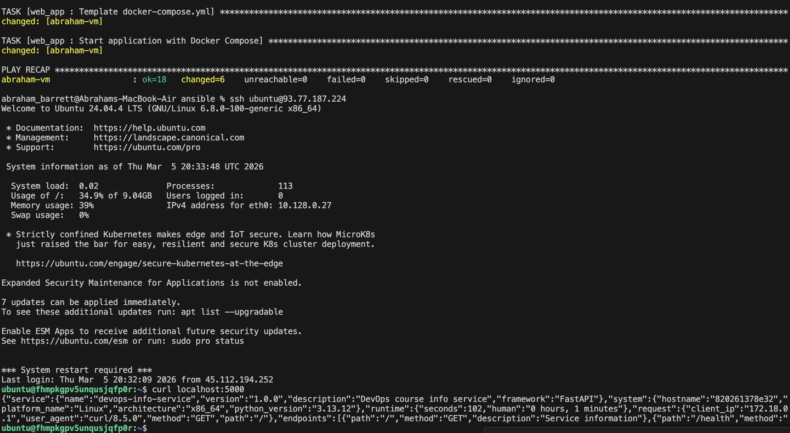
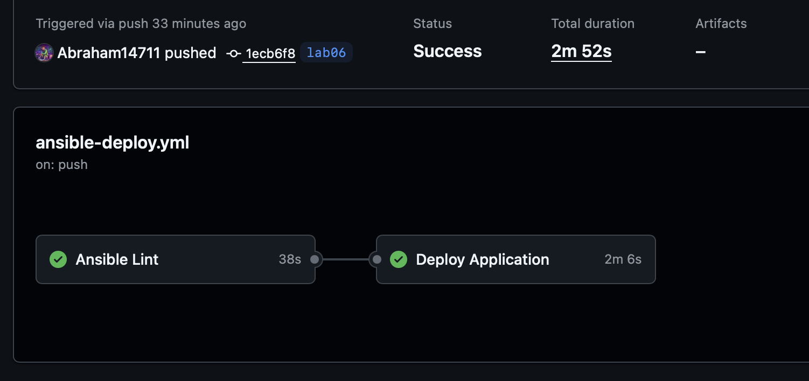
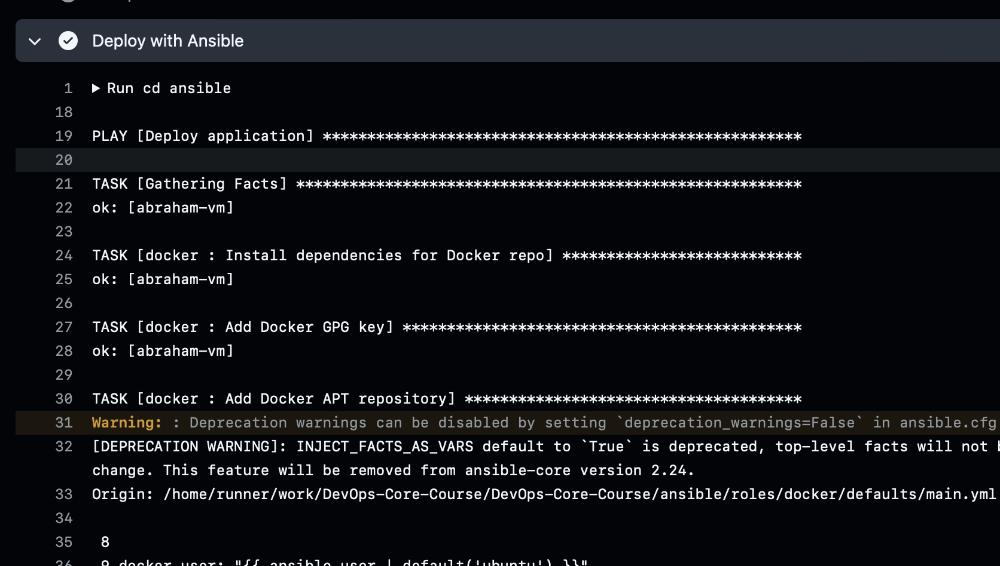
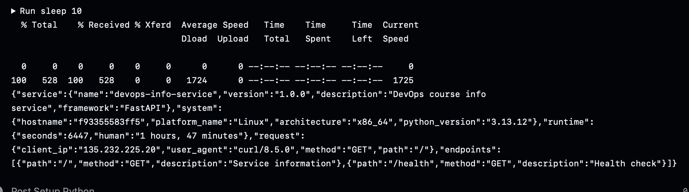

# Lab 6: Advanced Ansible & CI/CD - Submission
# Zavadskii Peter

# Task 1: Refactor with Blocks & Tags

In this task I have refactored my code and obtained such output after testing using all the commands in the tasks 

```bash
abraham_barrett@Abrahams-MacBook-Air ansible % ansible-playbook playbooks/provision.yml --tags docker --ask-vault-pass -i inventory/hosts.ini\ 
Vault password: 

PLAY [Provision web servers] *************************************************************************************************************************************

TASK [Gathering Facts] *******************************************************************************************************************************************
ok: [abraham-vm]

TASK [docker : Install dependencies for Docker repo] *************************************************************************************************************
ok: [abraham-vm]

TASK [docker : Add Docker GPG key] *******************************************************************************************************************************
changed: [abraham-vm]

TASK [docker : Add Docker APT repository] ************************************************************************************************************************
[WARNING]: Deprecation warnings can be disabled by setting `deprecation_warnings=False` in ansible.cfg.
[DEPRECATION WARNING]: INJECT_FACTS_AS_VARS default to `True` is deprecated, top-level facts will not be auto injected after the change. This feature will be removed from ansible-core version 2.24.
Origin: /Users/abraham_barrett/Documents/DevOps-Core-Course/ansible/roles/docker/defaults/main.yml:10:18

 8
 9 docker_user: "{{ ansible_user | default('ubuntu') }}"
10 docker_apt_repo: "deb [arch=amd64] https://download.docker.com/linux/ubuntu {{ ansible_distribution_release }} sta...
                    ^ column 18

Use `ansible_facts["fact_name"]` (no `ansible_` prefix) instead.

changed: [abraham-vm]

TASK [docker : Install Docker packages] **************************************************************************************************************************
changed: [abraham-vm]

TASK [docker : Ensure Docker service enabled] ********************************************************************************************************************
ok: [abraham-vm]

TASK [docker : Ensure Docker service is running] *****************************************************************************************************************
ok: [abraham-vm]

TASK [docker : Add user to docker group] *************************************************************************************************************************
changed: [abraham-vm]

TASK [docker : Install python3-docker] ***************************************************************************************************************************
changed: [abraham-vm]

TASK [docker : Ensure Docker service enabled] ********************************************************************************************************************
ok: [abraham-vm]

RUNNING HANDLER [docker : restart docker] ************************************************************************************************************************
changed: [abraham-vm]

PLAY RECAP *******************************************************************************************************************************************************
abraham-vm                 : ok=11   changed=6    unreachable=0    failed=0    skipped=0    rescued=0    ignored=0   
```

```bash
abraham_barrett@Abrahams-MacBook-Air ansible % ansible-playbook playbooks/provision.yml --tags docker_install --ask-vault-pass -i inventory/hosts.ini\ 
Vault password: 

PLAY [Provision web servers] *************************************************************************************************************************************

TASK [Gathering Facts] *******************************************************************************************************************************************
ok: [abraham-vm]

TASK [docker : Install dependencies for Docker repo] *************************************************************************************************************
ok: [abraham-vm]

TASK [docker : Add Docker GPG key] *******************************************************************************************************************************
ok: [abraham-vm]

TASK [docker : Add Docker APT repository] ************************************************************************************************************************
[WARNING]: Deprecation warnings can be disabled by setting `deprecation_warnings=False` in ansible.cfg.
[DEPRECATION WARNING]: INJECT_FACTS_AS_VARS default to `True` is deprecated, top-level facts will not be auto injected after the change. This feature will be removed from ansible-core version 2.24.
Origin: /Users/abraham_barrett/Documents/DevOps-Core-Course/ansible/roles/docker/defaults/main.yml:10:18

 8
 9 docker_user: "{{ ansible_user | default('ubuntu') }}"
10 docker_apt_repo: "deb [arch=amd64] https://download.docker.com/linux/ubuntu {{ ansible_distribution_release }} sta...
                    ^ column 18

Use `ansible_facts["fact_name"]` (no `ansible_` prefix) instead.

ok: [abraham-vm]

TASK [docker : Install Docker packages] **************************************************************************************************************************
ok: [abraham-vm]

TASK [docker : Ensure Docker service enabled] ********************************************************************************************************************
ok: [abraham-vm]

PLAY RECAP *******************************************************************************************************************************************************
abraham-vm                 : ok=6    changed=0    unreachable=0    failed=0    skipped=0    rescued=0    ignored=0   

abraham_barrett@Abrahams-MacBook-Air ansible %
```

```bash
abraham_barrett@Abrahams-MacBook-Air ansible % ansible-playbook  playbooks/provision.yml --tags packages --ask-vault-pass -i inventory/hosts.ini\ 
Vault password: 

PLAY [Provision web servers] *************************************************************************************************************************************

TASK [Gathering Facts] *******************************************************************************************************************************************
ok: [abraham-vm]

TASK [common : Update apt cache] *********************************************************************************************************************************
ok: [abraham-vm]

TASK [common : Install common packages] **************************************************************************************************************************
changed: [abraham-vm]

TASK [common : Log completion of common packages block] **********************************************************************************************************
changed: [abraham-vm]

PLAY RECAP *******************************************************************************************************************************************************
abraham-vm                 : ok=4    changed=2    unreachable=0    failed=0    skipped=0    rescued=0    ignored=0   

```

```bash
abraham_barrett@Abrahams-MacBook-Air ansible % ansible-playbook  playbooks/provision.yml --skip-tags common --ask-vault-pass -i inventory/hosts.ini\ 
Vault password: 

PLAY [Provision web servers] *************************************************************************************************************************************

TASK [Gathering Facts] *******************************************************************************************************************************************
ok: [abraham-vm]

TASK [common : Update apt cache] *********************************************************************************************************************************
changed: [abraham-vm]

TASK [common : Install common packages] **************************************************************************************************************************
ok: [abraham-vm]

TASK [common : Log completion of common packages block] **********************************************************************************************************
changed: [abraham-vm]

TASK [common : Create main user] *********************************************************************************************************************************
ok: [abraham-vm]

TASK [common : Log completion of user block] *********************************************************************************************************************
changed: [abraham-vm]

TASK [docker : Install dependencies for Docker repo] *************************************************************************************************************
ok: [abraham-vm]

TASK [docker : Add Docker GPG key] *******************************************************************************************************************************
ok: [abraham-vm]

TASK [docker : Add Docker APT repository] ************************************************************************************************************************
[WARNING]: Deprecation warnings can be disabled by setting `deprecation_warnings=False` in ansible.cfg.
[DEPRECATION WARNING]: INJECT_FACTS_AS_VARS default to `True` is deprecated, top-level facts will not be auto injected after the change. This feature will be removed from ansible-core version 2.24.
Origin: /Users/abraham_barrett/Documents/DevOps-Core-Course/ansible/roles/docker/defaults/main.yml:10:18

 8
 9 docker_user: "{{ ansible_user | default('ubuntu') }}"
10 docker_apt_repo: "deb [arch=amd64] https://download.docker.com/linux/ubuntu {{ ansible_distribution_release }} sta...
                    ^ column 18

Use `ansible_facts["fact_name"]` (no `ansible_` prefix) instead.

ok: [abraham-vm]

TASK [docker : Install Docker packages] **************************************************************************************************************************
ok: [abraham-vm]

TASK [docker : Ensure Docker service enabled] ********************************************************************************************************************
ok: [abraham-vm]

TASK [docker : Ensure Docker service is running] *****************************************************************************************************************
ok: [abraham-vm]

TASK [docker : Add user to docker group] *************************************************************************************************************************
ok: [abraham-vm]

TASK [docker : Install python3-docker] ***************************************************************************************************************************
ok: [abraham-vm]

TASK [docker : Ensure Docker service enabled] ********************************************************************************************************************
ok: [abraham-vm]

PLAY RECAP *******************************************************************************************************************************************************
abraham-vm                 : ok=15   changed=3    unreachable=0    failed=0    skipped=0    rescued=0    ignored=0   

```

```bash
abraham_barrett@Abrahams-MacBook-Air ansible % ansible-playbook  playbooks/provision.yml --tags docker --check --ask-vault-pass -i inventory/hosts.ini\ 
Vault password: 

PLAY [Provision web servers] *************************************************************************************************************************************

TASK [Gathering Facts] *******************************************************************************************************************************************
ok: [abraham-vm]

TASK [docker : Install dependencies for Docker repo] *************************************************************************************************************
ok: [abraham-vm]

TASK [docker : Add Docker GPG key] *******************************************************************************************************************************
ok: [abraham-vm]

TASK [docker : Add Docker APT repository] ************************************************************************************************************************
[WARNING]: Deprecation warnings can be disabled by setting `deprecation_warnings=False` in ansible.cfg.
[DEPRECATION WARNING]: INJECT_FACTS_AS_VARS default to `True` is deprecated, top-level facts will not be auto injected after the change. This feature will be removed from ansible-core version 2.24.
Origin: /Users/abraham_barrett/Documents/DevOps-Core-Course/ansible/roles/docker/defaults/main.yml:10:18

 8
 9 docker_user: "{{ ansible_user | default('ubuntu') }}"
10 docker_apt_repo: "deb [arch=amd64] https://download.docker.com/linux/ubuntu {{ ansible_distribution_release }} sta...
                    ^ column 18

Use `ansible_facts["fact_name"]` (no `ansible_` prefix) instead.

ok: [abraham-vm]

TASK [docker : Install Docker packages] **************************************************************************************************************************
ok: [abraham-vm]

TASK [docker : Ensure Docker service enabled] ********************************************************************************************************************
ok: [abraham-vm]

TASK [docker : Ensure Docker service is running] *****************************************************************************************************************
ok: [abraham-vm]

TASK [docker : Add user to docker group] *************************************************************************************************************************
ok: [abraham-vm]

TASK [docker : Install python3-docker] ***************************************************************************************************************************
ok: [abraham-vm]

TASK [docker : Ensure Docker service enabled] ********************************************************************************************************************
ok: [abraham-vm]

PLAY RECAP *******************************************************************************************************************************************************
abraham-vm                 : ok=10   changed=0    unreachable=0    failed=0    skipped=0    rescued=0    ignored=0   

abraham_barrett@Abrahams-MacBook-Air ansible % 
```

Here you can see the list of available tags
```bash
abraham_barrett@Abrahams-MacBook-Air ansible % ansible-playbook  playbooks/provision.yml --list-tags --ask-vault-pass -i inventory/hosts.ini\ 
Vault password: 

playbook: playbooks/provision.yml

  play #1 (webservers): Provision web servers   TAGS: []
      TASK TAGS: [docker, docker_config, docker_install, packages, users]
```

# Task 2: Docker Compose


Output showing Docker Compose deployment success
```bash
abraham_barrett@Abrahams-MacBook-Air ansible % ansible-playbook  playbooks/deploy.yml  --ask-vault-pass -i inventory/hosts.ini\ 
Vault password: 

PLAY [Deploy application] ****************************************************************************************************************************************

TASK [Gathering Facts] *******************************************************************************************************************************************
ok: [abraham-vm]

TASK [docker : Install dependencies for Docker repo] *************************************************************************************************************
ok: [abraham-vm]

TASK [docker : Add Docker GPG key] *******************************************************************************************************************************
ok: [abraham-vm]

TASK [docker : Add Docker APT repository] ************************************************************************************************************************
[WARNING]: Deprecation warnings can be disabled by setting `deprecation_warnings=False` in ansible.cfg.
[DEPRECATION WARNING]: INJECT_FACTS_AS_VARS default to `True` is deprecated, top-level facts will not be auto injected after the change. This feature will be removed from ansible-core version 2.24.
Origin: /Users/abraham_barrett/Documents/DevOps-Core-Course/ansible/roles/docker/defaults/main.yml:10:18

 8
 9 docker_user: "{{ ansible_user | default('ubuntu') }}"
10 docker_apt_repo: "deb [arch=amd64] https://download.docker.com/linux/ubuntu {{ ansible_distribution_release }} sta...
                    ^ column 18

Use `ansible_facts["fact_name"]` (no `ansible_` prefix) instead.

ok: [abraham-vm]

TASK [docker : Install Docker packages] **************************************************************************************************************************
ok: [abraham-vm]

TASK [docker : Ensure Docker service enabled] ********************************************************************************************************************
ok: [abraham-vm]

TASK [docker : Ensure Docker service is running] *****************************************************************************************************************
ok: [abraham-vm]

TASK [docker : Add user to docker group] *************************************************************************************************************************
ok: [abraham-vm]

TASK [docker : Install python3-docker] ***************************************************************************************************************************
ok: [abraham-vm]

TASK [docker : Ensure Docker service enabled] ********************************************************************************************************************
ok: [abraham-vm]

TASK [web_app : Create application directory] ********************************************************************************************************************
ok: [abraham-vm]

TASK [web_app : Template docker-compose.yml] *********************************************************************************************************************
changed: [abraham-vm]

TASK [web_app : Start application with Docker Compose] ***********************************************************************************************************
[WARNING]: Docker compose: unknown None: /opt/devops-info-service/docker-compose.yml: the attribute `version` is obsolete, it will be ignored, please remove it to avoid potential confusion
changed: [abraham-vm]

PLAY RECAP *******************************************************************************************************************************************************
abraham-vm                 : ok=13   changed=2    unreachable=0    failed=0    skipped=0    rescued=0    ignored=0   
```

Idempotency proof (second run shows "ok" not "changed")
```bash
abraham_barrett@Abrahams-MacBook-Air ansible % ansible-playbook  playbooks/deploy.yml  --ask-vault-pass -i inventory/hosts.ini
Vault password: 

PLAY [Deploy application] ***********************************************************************************************************************

TASK [Gathering Facts] **************************************************************************************************************************
ok: [abraham-vm]

TASK [docker : Install dependencies for Docker repo] ********************************************************************************************
ok: [abraham-vm]

TASK [docker : Add Docker GPG key] **************************************************************************************************************
ok: [abraham-vm]

TASK [docker : Add Docker APT repository] *******************************************************************************************************
[WARNING]: Deprecation warnings can be disabled by setting `deprecation_warnings=False` in ansible.cfg.
[DEPRECATION WARNING]: INJECT_FACTS_AS_VARS default to `True` is deprecated, top-level facts will not be auto injected after the change. This feature will be removed from ansible-core version 2.24.
Origin: /Users/abraham_barrett/Documents/DevOps-Core-Course/ansible/roles/docker/defaults/main.yml:10:18

 8
 9 docker_user: "{{ ansible_user | default('ubuntu') }}"
10 docker_apt_repo: "deb [arch=amd64] https://download.docker.com/linux/ubuntu {{ ansible_distribution_release }} sta...
                    ^ column 18

Use `ansible_facts["fact_name"]` (no `ansible_` prefix) instead.

ok: [abraham-vm]

TASK [docker : Install Docker packages] *********************************************************************************************************
ok: [abraham-vm]

TASK [docker : Ensure Docker service enabled] ***************************************************************************************************
ok: [abraham-vm]

TASK [docker : Ensure Docker service is running] ************************************************************************************************
ok: [abraham-vm]

TASK [docker : Add user to docker group] ********************************************************************************************************
ok: [abraham-vm]

TASK [docker : Install python3-docker] **********************************************************************************************************
ok: [abraham-vm]

TASK [docker : Ensure Docker service enabled] ***************************************************************************************************
ok: [abraham-vm]

TASK [web_app : Include wipe tasks] *************************************************************************************************************
included: /Users/abraham_barrett/Documents/DevOps-Core-Course/ansible/roles/web_app/tasks/wipe.yml for abraham-vm

TASK [web_app : Stop and remove containers] *****************************************************************************************************
skipping: [abraham-vm]

TASK [web_app : Remove docker-compose file] *****************************************************************************************************
skipping: [abraham-vm]

TASK [web_app : Remove application directory] ***************************************************************************************************
skipping: [abraham-vm]

TASK [web_app : Log wipe completion] ************************************************************************************************************
skipping: [abraham-vm]

TASK [web_app : Create application directory] ***************************************************************************************************
ok: [abraham-vm]

TASK [web_app : Template docker-compose.yml] ****************************************************************************************************
ok: [abraham-vm]

TASK [web_app : Start application with Docker Compose] ******************************************************************************************
[WARNING]: Docker compose: unknown None: /opt/devops-info-service/docker-compose.yml: the attribute `version` is obsolete, it will be ignored, please remove it to avoid potential confusion
ok: [abraham-vm]

PLAY RECAP **************************************************************************************************************************************
abraham-vm                 : ok=14   changed=0    unreachable=0    failed=0    skipped=4    rescued=0    ignored=0   

abraham_barrett@Abrahams-MacBook-Air ansible % 
```

Application is running and accessable

```bash
ubuntu@fhmpkgpv5unqusjqfp0r:~$ curl localhost:5000
{"service":{"name":"devops-info-service","version":"1.0.0","description":"DevOps course info service","framework":"FastAPI"},"system":{"hostname":"820261378e32","platform_name":"Linux","architecture":"x86_64","python_version":"3.13.12"},"runtime":{"seconds":1025,"human":"0 hours, 17 minutes"},"request":{"client_ip":"172.18.0.1","user_agent":"curl/8.5.0","method":"GET","path":"/"},"endpoints":[{"path":"/","method":"GET","description":"Service information"},{"path":"/health","method":"GET","description":"Health check"}]}ubuntu@fhmpkgpv5unqusjqfp0r:~$ 
```

Templated docker compose 


```bash
version: "3.8"

services:
  devops-info-service:
    image: "abrahambarrett228/devops-info-service:latest"
    container_name: "devops-info-service"

    ports:
      - "5000:5000"

    restart: unless-stopped
```
# Task 3: Wipe Logic

Here you will see the output of all 4 scenarios : (as you can see all of them were successfully finished)

### Scenario 1

```bash
abraham_barrett@Abrahams-MacBook-Air ansible % ansible-playbook  playbooks/deploy.yml  --ask-vault-pass -i inventory/hosts.ini\ 
Vault password: 

PLAY [Deploy application] ****************************************************************************************************************************************

TASK [Gathering Facts] *******************************************************************************************************************************************
ok: [abraham-vm]

TASK [docker : Install dependencies for Docker repo] *************************************************************************************************************
ok: [abraham-vm]

TASK [docker : Add Docker GPG key] *******************************************************************************************************************************
ok: [abraham-vm]

TASK [docker : Add Docker APT repository] ************************************************************************************************************************
[WARNING]: Deprecation warnings can be disabled by setting `deprecation_warnings=False` in ansible.cfg.
[DEPRECATION WARNING]: INJECT_FACTS_AS_VARS default to `True` is deprecated, top-level facts will not be auto injected after the change. This feature will be removed from ansible-core version 2.24.
Origin: /Users/abraham_barrett/Documents/DevOps-Core-Course/ansible/roles/docker/defaults/main.yml:10:18

 8
 9 docker_user: "{{ ansible_user | default('ubuntu') }}"
10 docker_apt_repo: "deb [arch=amd64] https://download.docker.com/linux/ubuntu {{ ansible_distribution_release }} sta...
                    ^ column 18

Use `ansible_facts["fact_name"]` (no `ansible_` prefix) instead.

ok: [abraham-vm]

TASK [docker : Install Docker packages] **************************************************************************************************************************
ok: [abraham-vm]

TASK [docker : Ensure Docker service enabled] ********************************************************************************************************************
ok: [abraham-vm]

TASK [docker : Ensure Docker service is running] *****************************************************************************************************************
ok: [abraham-vm]

TASK [docker : Add user to docker group] *************************************************************************************************************************
ok: [abraham-vm]

TASK [docker : Install python3-docker] ***************************************************************************************************************************
ok: [abraham-vm]

TASK [docker : Ensure Docker service enabled] ********************************************************************************************************************
ok: [abraham-vm]

TASK [web_app : Include wipe tasks] ******************************************************************************************************************************
included: /Users/abraham_barrett/Documents/DevOps-Core-Course/ansible/roles/web_app/tasks/wipe.yml for abraham-vm

TASK [web_app : Stop and remove containers] **********************************************************************************************************************
skipping: [abraham-vm]

TASK [web_app : Remove docker-compose file] **********************************************************************************************************************
skipping: [abraham-vm]

TASK [web_app : Remove application directory] ********************************************************************************************************************
skipping: [abraham-vm]

TASK [web_app : Log wipe completion] *****************************************************************************************************************************
skipping: [abraham-vm]

TASK [web_app : Create application directory] ********************************************************************************************************************
ok: [abraham-vm]

TASK [web_app : Template docker-compose.yml] *********************************************************************************************************************
ok: [abraham-vm]

TASK [web_app : Start application with Docker Compose] ***********************************************************************************************************
[WARNING]: Docker compose: unknown None: /opt/devops-info-service/docker-compose.yml: the attribute `version` is obsolete, it will be ignored, please remove it to avoid potential confusion
ok: [abraham-vm]

PLAY RECAP *******************************************************************************************************************************************************
abraham-vm                 : ok=14   changed=0    unreachable=0    failed=0    skipped=4    rescued=0    ignored=0   
```

### Scenario 2

```bash
abraham_barrett@Abrahams-MacBook-Air ansible % ansible-playbook  playbooks/deploy.yml  -e "web_app_wipe=true" --tags web_app_wipe --ask-vault-pass -i inventory/hosts.ini\
Vault password: 

PLAY [Deploy application] ****************************************************************************************************************************************

TASK [Gathering Facts] *******************************************************************************************************************************************
ok: [abraham-vm]

TASK [web_app : Include wipe tasks] ******************************************************************************************************************************
included: /Users/abraham_barrett/Documents/DevOps-Core-Course/ansible/roles/web_app/tasks/wipe.yml for abraham-vm

TASK [web_app : Stop and remove containers] **********************************************************************************************************************
[WARNING]: Docker compose: unknown None: /opt/devops-info-service/docker-compose.yml: the attribute `version` is obsolete, it will be ignored, please remove it to avoid potential confusion
changed: [abraham-vm]

TASK [web_app : Remove docker-compose file] **********************************************************************************************************************
changed: [abraham-vm]

TASK [web_app : Remove application directory] ********************************************************************************************************************
changed: [abraham-vm]

TASK [web_app : Log wipe completion] *****************************************************************************************************************************
ok: [abraham-vm] => {
    "msg": "Application devops-info-service wiped successfully"
}

PLAY RECAP *******************************************************************************************************************************************************
abraham-vm                 : ok=6    changed=3    unreachable=0    failed=0    skipped=0    rescued=0    ignored=0   
```

### Scenario 3

```bash
abraham_barrett@Abrahams-MacBook-Air ansible % ansible-playbook  playbooks/deploy.yml  -e "web_app_wipe=true" --ask-vault-pass -i inventory/hosts.ini\ 
Vault password: 

PLAY [Deploy application] ****************************************************************************************************************************************

TASK [Gathering Facts] *******************************************************************************************************************************************
ok: [abraham-vm]

TASK [docker : Install dependencies for Docker repo] *************************************************************************************************************
ok: [abraham-vm]

TASK [docker : Add Docker GPG key] *******************************************************************************************************************************
ok: [abraham-vm]

TASK [docker : Add Docker APT repository] ************************************************************************************************************************
[WARNING]: Deprecation warnings can be disabled by setting `deprecation_warnings=False` in ansible.cfg.
[DEPRECATION WARNING]: INJECT_FACTS_AS_VARS default to `True` is deprecated, top-level facts will not be auto injected after the change. This feature will be removed from ansible-core version 2.24.
Origin: /Users/abraham_barrett/Documents/DevOps-Core-Course/ansible/roles/docker/defaults/main.yml:10:18

 8
 9 docker_user: "{{ ansible_user | default('ubuntu') }}"
10 docker_apt_repo: "deb [arch=amd64] https://download.docker.com/linux/ubuntu {{ ansible_distribution_release }} sta...
                    ^ column 18

Use `ansible_facts["fact_name"]` (no `ansible_` prefix) instead.

ok: [abraham-vm]

TASK [docker : Install Docker packages] **************************************************************************************************************************
ok: [abraham-vm]

TASK [docker : Ensure Docker service enabled] ********************************************************************************************************************
ok: [abraham-vm]

TASK [docker : Ensure Docker service is running] *****************************************************************************************************************
ok: [abraham-vm]

TASK [docker : Add user to docker group] *************************************************************************************************************************
ok: [abraham-vm]

TASK [docker : Install python3-docker] ***************************************************************************************************************************
ok: [abraham-vm]

TASK [docker : Ensure Docker service enabled] ********************************************************************************************************************
ok: [abraham-vm]

TASK [web_app : Include wipe tasks] ******************************************************************************************************************************
included: /Users/abraham_barrett/Documents/DevOps-Core-Course/ansible/roles/web_app/tasks/wipe.yml for abraham-vm

TASK [web_app : Stop and remove containers] **********************************************************************************************************************
[ERROR]: Task failed: Module failed: "/opt/devops-info-service" is not a directory
Origin: /Users/abraham_barrett/Documents/DevOps-Core-Course/ansible/roles/web_app/tasks/wipe.yml:5:7

3   block:
4
5     - name: Stop and remove containers
        ^ column 7

fatal: [abraham-vm]: FAILED! => {"changed": false, "msg": "\"/opt/devops-info-service\" is not a directory"}
...ignoring

TASK [web_app : Remove docker-compose file] **********************************************************************************************************************
ok: [abraham-vm]

TASK [web_app : Remove application directory] ********************************************************************************************************************
ok: [abraham-vm]

TASK [web_app : Log wipe completion] *****************************************************************************************************************************
ok: [abraham-vm] => {
    "msg": "Application devops-info-service wiped successfully"
}

TASK [web_app : Create application directory] ********************************************************************************************************************
changed: [abraham-vm]

TASK [web_app : Template docker-compose.yml] *********************************************************************************************************************
changed: [abraham-vm]

TASK [web_app : Start application with Docker Compose] ***********************************************************************************************************
[WARNING]: Docker compose: unknown None: /opt/devops-info-service/docker-compose.yml: the attribute `version` is obsolete, it will be ignored, please remove it to avoid potential confusion
changed: [abraham-vm]

PLAY RECAP *******************************************************************************************************************************************************
abraham-vm                 : ok=18   changed=3    unreachable=0    failed=0    skipped=0    rescued=0    ignored=1   
```

### Scenario 4

```bash
abraham_barrett@Abrahams-MacBook-Air ansible % ansible-playbook  playbooks/deploy.yml --tags web_app_wipe --ask-vault-pass -i inventory/hosts.ini\ 
Vault password: 

PLAY [Deploy application] ****************************************************************************************************************************************

TASK [Gathering Facts] *******************************************************************************************************************************************
ok: [abraham-vm]

TASK [web_app : Include wipe tasks] ******************************************************************************************************************************
included: /Users/abraham_barrett/Documents/DevOps-Core-Course/ansible/roles/web_app/tasks/wipe.yml for abraham-vm

TASK [web_app : Stop and remove containers] **********************************************************************************************************************
skipping: [abraham-vm]

TASK [web_app : Remove docker-compose file] **********************************************************************************************************************
skipping: [abraham-vm]

TASK [web_app : Remove application directory] ********************************************************************************************************************
skipping: [abraham-vm]

TASK [web_app : Log wipe completion] *****************************************************************************************************************************
skipping: [abraham-vm]

PLAY RECAP *******************************************************************************************************************************************************
abraham-vm                 : ok=2    changed=0    unreachable=0    failed=0    skipped=4    rescued=0    ignored=0   

abraham_barrett@Abrahams-MacBook-Air ansible % 
```

Screenshot of application running after clean reinstall :


Research questions answers : 

1. Why use both variable AND tag?

 - Using both a variable and a tag provides a double safety mechanism. Variables can control behavior dynamically (e.g., enabling/disabling a role or block), while tags allow selective execution from the command line. Together, they prevent accidental execution of critical tasks and give flexibility for testing or partial runs.

2. What's the difference between a never tag and this approach?

 - A never tag is a convention used to explicitly mark tasks that should never run unless overridden. The variable-plus-tag approach is more flexible: it allows tasks to run conditionally based on runtime variables and still supports selective execution with tags. never is static, while variable + tag is dynamic.
3. Why must wipe logic come BEFORE deployment in main.yml?

 - Wipe logic must run first to clean any existing state (packages, configurations, or previous deployments) before applying the new configuration. This ensures a clean reinstall scenario, avoiding conflicts, leftover files, or inconsistent states during deployment.

4. When would you want clean reinstallation vs. rolling update?

 - Clean reinstallation is needed when the existing system is broken, corrupted, or you want a guaranteed reproducible state.
Rolling update is preferred when you want to update services with minimal downtime, preserving current data and only applying incremental changes.

5. How would you extend this to wipe Docker images and volumes too?

 - You can add a wipe block in the Docker role with tasks like:
docker_container module with state: absent to remove containers
docker_image module with state: absent to remove images
docker_volume module with state: absent to remove volumes
Include a when: wipe_docker | default(false) conditional and appropriate tags (e.g., wipe_docker) to make it optional and safely executable.

# Task 4: CI/CD

Screenshot of successful workflow run


Output logs showing ansible-playbook execution


Verification: 



Questions section : 

1. What are the security implications of storing SSH keys in GitHub Secrets?

Storing SSH keys in GitHub Secrets is generally safe because secrets are encrypted at rest and not exposed in logs by default. However, if a workflow is misconfigured (e.g., prints the secret or uses untrusted actions), the keys could be leaked, giving attackers access to servers. Proper access controls and minimal key permissions are essential.

2. How would you implement a staging → production deployment pipeline?
 
 Implement a two-stage pipeline:
 - Staging stage: Deploy changes automatically or on pull request merge, run tests, and validate functionality.
 - Production stage: Deploy only after staging validation, optionally requiring manual approval or an automated promotion trigger. Use separate environments, credentials, and branch protections to avoid accidental production changes.

3. What would you add to make rollbacks possible?

- Versioned deployments (e.g., tags, releases, or container image versions)
- Backup of current configuration or database before deployment
- Store previous release artifacts and track their state
- Add automated rollback tasks in the pipeline to restore a known good version if deployment fails

4. How does a self-hosted runner improve security compared to GitHub-hosted?

Self-hosted runners allow you to control the hardware, network, and access environment, reducing exposure to multi-tenant cloud runners. Sensitive operations (like deploying with private keys or accessing internal networks) can be executed securely on your controlled infrastructure, minimizing risk of secret leakage or untrusted code execution.

# Task 5: Documentation