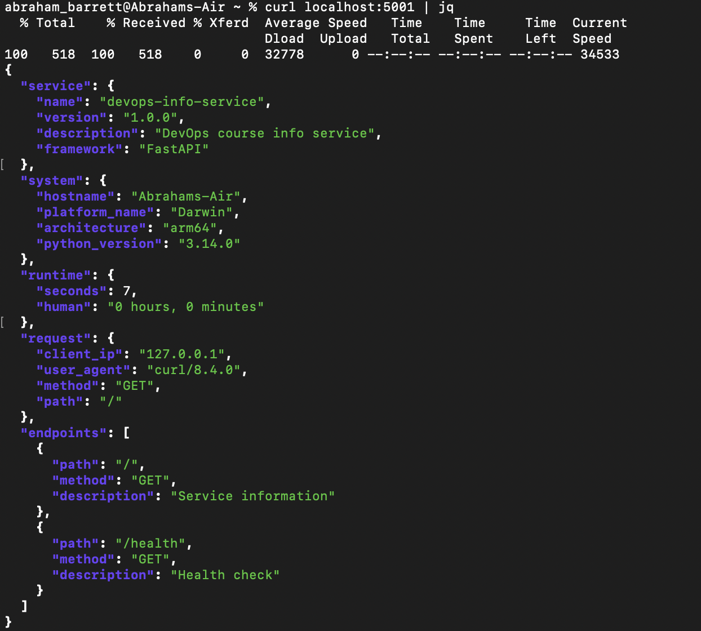
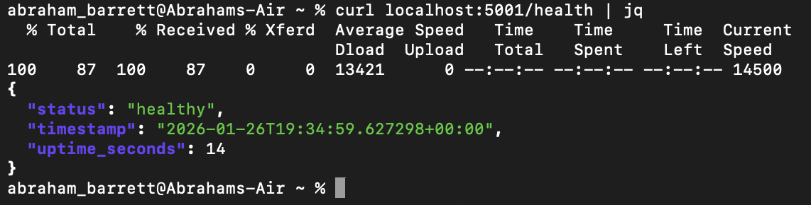
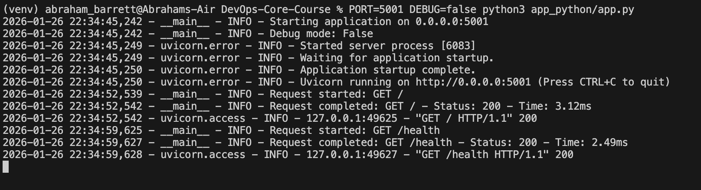

# Lab 01

## Chosing Web Framework

### Choice: FastAPI

Reasons:

- High Performance 
- Automatic Documentation ( Auto-generates OpenAPI/Swagger documentation)
- Data Validation - Built-in validation via Pydantic


### Comparison table on a five-point scale
|  Criteria   | FastApi  |   Flask   |   Django  |
|-------------|----------|-----------|-----------|
|Performance  |     5    |    3      |     3     |
|Documentation|   5      |    3      |     4     |
| Simplicity  |      5   |     4     |     3     |
| Security    |       5  |     3     |     4     |

## Best Practices Applied

- Clear function names like `get_uptime()` and `get_system()` - increase code readability

Example:

```python
def get_uptime():
    delta = datetime.now() - start_time
    seconds = int(delta.total_seconds())
    hours = seconds // 3600
    minutes = (seconds % 3600) // 60
    return {
        'seconds': seconds,
        'human': f"{hours} hours, {minutes} minutes"
    }


def get_system():
    import platform
    import socket

    return {
        "hostname": socket.gethostname(),
        "platform_name": platform.system(),
        "architecture": platform.machine(),
        "python_version": platform.python_version(),
    }
```

- Logging makes debugging easier

Example:

```python
@app.middleware("http")
async def log_requests(request: fastapi.Request, call_next):
    start_time_middleware = datetime.now()

    logger.info(f"Request started: {request.method} {request.url.path}")
    logger.debug(f"Headers: {dict(request.headers)}")
    logger.debug(
        f"Client IP: {
            request.client.host if request.client else 'Unknown'}")

    try:
        response = await call_next(request)
        process_time = (
            datetime.now() - start_time_middleware).total_seconds() * 1000

        logger.info(
            f"Request completed: {request.method} {request.url.path} "
            f"- Status: {response.status_code} "
            f"- Time: {process_time:.2f}ms"
        )

        return response

    except Exception as ex:
        logger.error(
            f"Request failed: {request.method} {request.url.path} - Error: {str(ex)}")
        raise
```

- Following PEP8 - increases code readability 

Example:

```bash
autopep8 --in-place --aggressive --aggressive app_python/app.py
 ```

- Error handling simplifies the process of understanding the cause of a malfunction in the code when making incorrect requests

Example:

```python
@app.exception_handler(RequestValidationError)
async def validation_exception_handler(
        request: fastapi.Request,
        exc: RequestValidationError):
    logger.warning(
        f"Validation error: {
            exc.errors()} for request {
            request.method} {
                request.url.path}")

    return JSONResponse(
        status_code=422,
        content={
            "error": "Validation Error",
            "message": "Invalid request parameters",
            "details": exc.errors(),
            "status_code": 422,
            "timestamp": datetime.now(timezone.utc).isoformat()
        }
    )
```

## API Documentation

API documentation can be found on `http://[HOST]:[PORT]/docs` (defaults to <http://127.0.0.1:8000/docs>)

***Request***

`curl http://localhost:5000/`

***Response***
```bash
{
  "service": {
    "name": "devops-info-service",
    "version": "1.0.0",
    "description": "DevOps course info service",
    "framework": "FastAPI"
  },
  "system": {
    "hostname": "Abrahams-Air",
    "platform_name": "Darwin",
    "architecture": "arm64",
    "python_version": "3.14.0"
  },
  "runtime": {
    "seconds": 7,
    "human": "0 hours, 0 minutes"
  },
  "request": {
    "client_ip": "127.0.0.1",
    "user_agent": "curl/8.4.0",
    "method": "GET",
    "path": "/"
  },
  "endpoints": [
    {
      "path": "/",
      "method": "GET",
      "description": "Service information"
    },
    {
      "path": "/health",
      "method": "GET",
      "description": "Health check"
    }
  ]
}
```
***Request***

`curl http://localhost:5000/health`

***Response***

```bash
{
  "status": "healthy",
  "timestamp": "2026-01-26T19:34:59.627298+00:00",
  "uptime_seconds": 14
}
```
## Testing Evidence

`/` endpoint:



`/health` endpoint:



some terminal output:



## GitHub Community

Starring repositories is a simple yet powerful way to support open-source projects — it helps maintainers gauge popularity, increases project visibility for new contributors, and creates a personal bookmarking system for discovering useful tools. Following developers on GitHub fosters professional growth by exposing you to diverse coding styles and project management approaches, while also building connections that can lead to collaboration opportunities in team environments.


**Actions Required:**
1. **Star** the course repository [Done]
2. **Star** the [simple-container-com/api](https://github.com/simple-container-com/api) project — a promising open-source tool for container management [Done]
3. **Follow** your professor and TAs on GitHub: [Done]
   - Professor: [@Cre-eD](https://github.com/Cre-eD)
   - TA: [@marat-biriushev](https://github.com/marat-biriushev)
   - TA: [@pierrepicaud](https://github.com/pierrepicaud) 
4. **Follow** at least 3 classmates from the course 
 - https://github.com/asqarslanov
 - https://github.com/FunnyFoXD
 - https://github.com/Woolfer0097