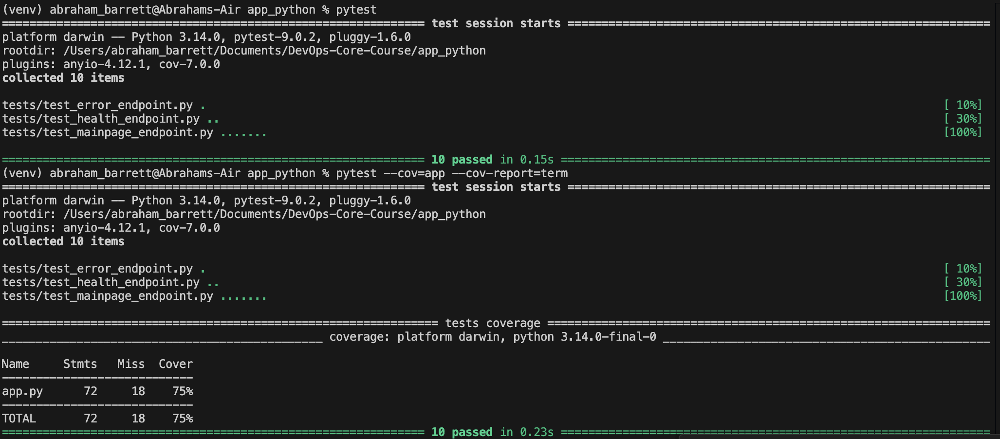

# DevOps Info Service — CI/CD Pipeline Documentation

## 1. Overview

### Testing Framework: pytest

### Why pytest?

- Simple and intuitive syntax with minimal boilerplate code
- Powerful fixture system for test setup/teardown
- Excellent plugin ecosystem (pytest-cov for coverage, etc.)
- Industry standard for Python testing
- Better assertion introspection than unittest

### Test Coverage:

| Endpoint | Tests | What's Tested |
|----------|-------|---------------|
| `GET /` | 7 tests | Status code, response structure, service info, system info, runtime progression, request info, endpoints list |
| `GET /health` | 2 tests | Status code, response structure (status, uptime, timestamp) |
| `404 Handler` | 1 test | Error response format and status code |

## CI Workflow Configuration

### Triggers:

- Push: master, main, lab03 branches
- Pull Request: master branch
- Path filters: Only runs when app_python/ or workflow files change
### Why these triggers?

- Running on lab03 branch enables testing during development
- PR checks prevent merging broken code
- Path filters optimize resource usage — no need to run Python CI when only Go/Rust code changes
- Versioning Strategy: Calendar Versioning (CalVer)

### Format: YYYY.MM.build-number (e.g., 2025.03.42)

#### Rationale:

This is a service, not a library — users don't need SemVer's breaking change semantics
CalVer provides immediate context about when the image was built
Dates are human-readable and eliminate version number debates
Perfect for continuous deployment workflow
Combined with build number ensures uniqueness
### Docker Tags:

- abrahambarrett228/devops-info-service:2025.03 — Monthly release track
- abrahambarrett228/devops-info-service:2025.03.42 — Specific build
- abrahambarrett228/devops-info-service:latest — Latest stable build

2. Workflow Evidence

 Successful GitHub Actions Run

 Local Tests Passing

 

 Docker Hub Image

 3. CI Best Practices Implemented

 | Practice | Implementation | Why It Matters |
|:---------|:---------------|:---------------|
| **1. Dependency Caching** | `actions/setup-python` with `cache: pip` | — Saves time per run by reusing pip cache |
| **2. Fail Fast** | `needs: test` in docker job | Prevents publishing broken images — if tests fail, Docker build never starts |
| **3. Conditional Deployment** | `if: github.ref == 'refs/heads/master'` | Only push Docker images from protected branches — prevents spam from feature branches |
| **4. Concurrency Control** | `concurrency.cancel-in-progress: true` | Cancels outdated workflow runs — saves resources on force-pushes |
| **5. Path Filtering** | `on.push.paths: ['app_python/**']` | CI runs only when relevant files change — saves 100% of runtime when editing docs |
| **6. Security Scanning** | Snyk with high severity threshold | 🔒 Catches vulnerable dependencies before production |
| **7. Coverage Threshold** | `--cov-fail-under=70` | Enforces minimum test coverage — prevents coverage regression |

4. Key Decisions

### Versioning Strategy: CalVer

Why not SemVer? This is a web service, not a library. Users don't pin versions in requirements.txt — they pull the latest Docker image. CalVer tells me immediately when an image was built. The date format 2025.03 is instantly recognizable and eliminates debates about "is this a major or minor change?" For continuous deployment, dates make more sense than arbitrary version numbers.
Docker Tags

CI generates three tags: latest, monthly version (2025.03), and specific build (2025.03.42). latest is for convenience, monthly tags provide stable release tracks, and build-specific tags enable rollbacks. The build number from GitHub Actions guarantees uniqueness even if multiple builds happen on the same day.

### Test Coverage:

Coverage is enforced at 70% but consistently runs at 75%.

What's covered:

All endpoint response structures and status codes
Dynamic behavior (uptime progression, timestamp formatting)
Error handling (404 responses)
Service metadata validation

### Workflow Triggers

I chose to run on both push to lab03/main and PRs to master. Running on development branches lets me catch issues early without creating PRs. PR checks act as a quality gate — no broken code reaches master. Path filters prevent wasting resources when I update only the Go app or documentation.
Test Coverage Strategy

