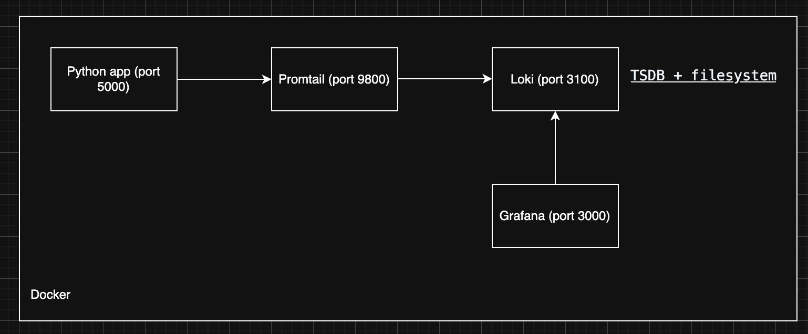
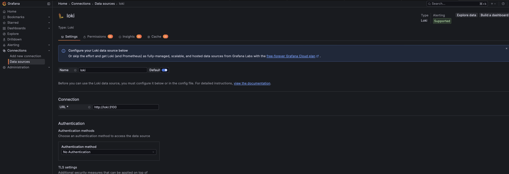
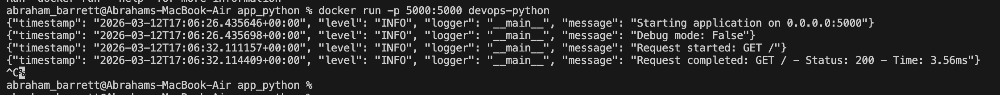
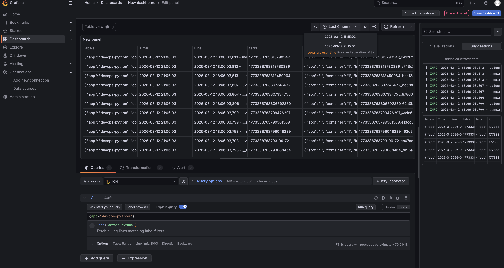
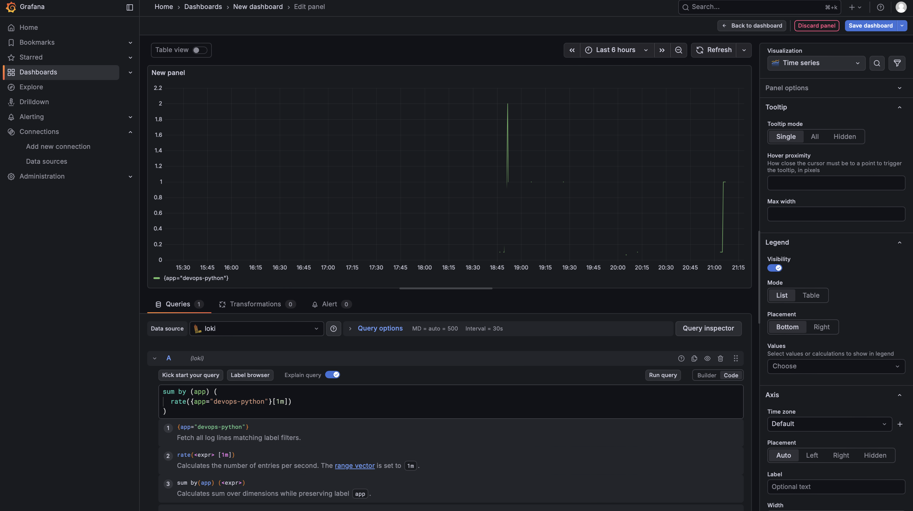
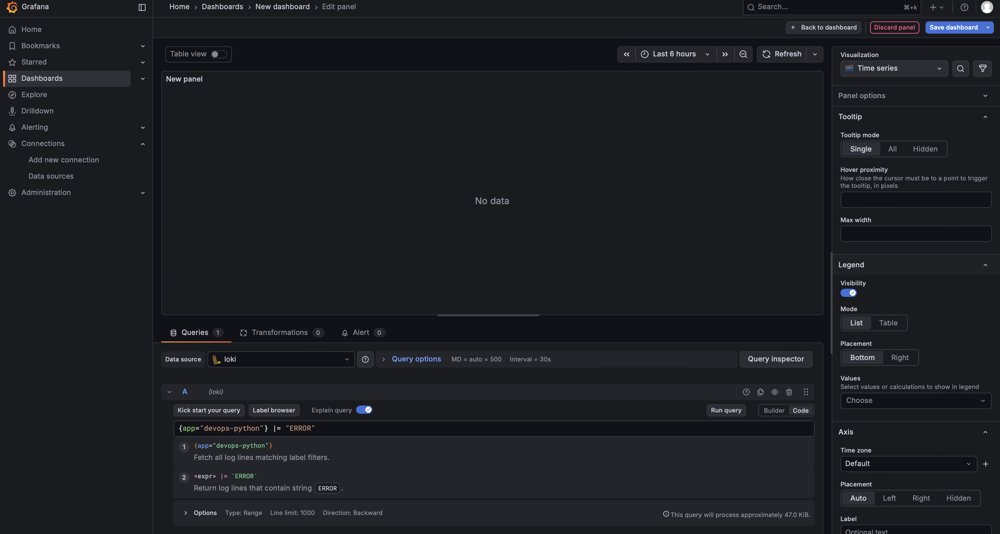
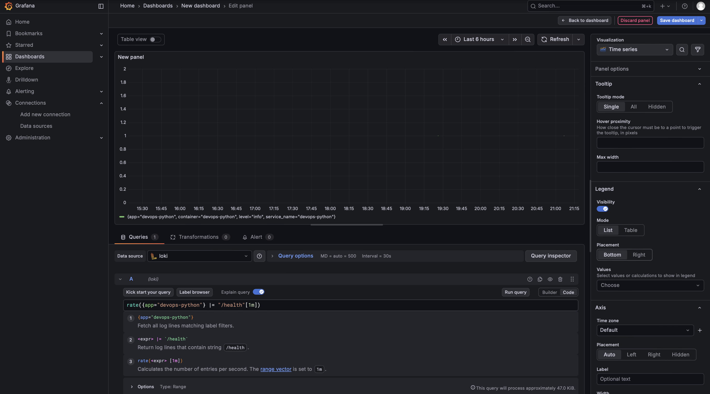
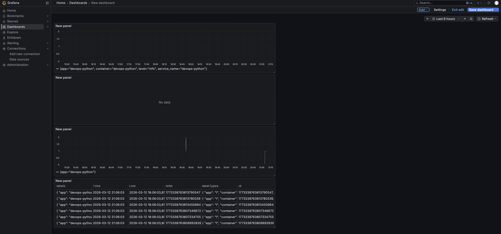
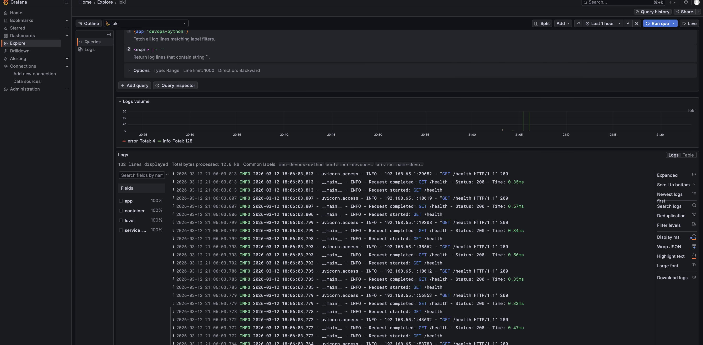
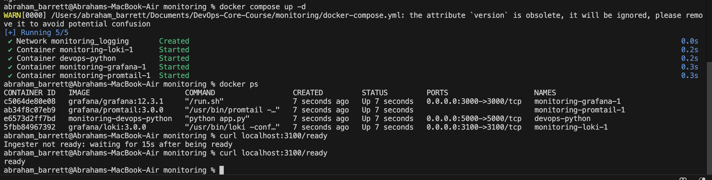

# Zavadskii Peter

## 1. Architecture - Diagram showing how components connect

My monitoring system had the following configuration : 


## 2. Setup Guide - Step-by-step deployment instructions

The initial configuration can be devided into 2 parts: 

```docker containers starting``` and ```grafana-loki``` connection.

1) Create and start docker containers by ```docker compose up -d```
2) Grafana can be connected to loki in the web interface (localhost:3000) (connections->data sources -> choose loki ->use http://loki:3100 as a url since they are connected by docker network -> press "save and test")



## 3. Configuration - Explain your Loki/Promtail configs and why

### Loki configuration explanation : 

```
server:
  http_listen_port: 3100
```
defines the HTTP API port used by Loki. Other services such as Grafana and Promtail communicate with Loki through this endpoint.

```
common:
  replication_factor: 1
  path_prefix: /loki
  ring:
    kvstore:
      store: inmemory
```
- replication_factor: 1 – since this is a single-node deployment, logs are stored only once.
- path_prefix – base directory where Loki stores its data.
- inmemory ring – used for service discovery between Loki components in a single-instance environment.

```
schema_config:
  configs:
    - from: 2024-01-01
      store: tsdb
      object_store: filesystem
      schema: v13
```
this section defines how logs are indexed and stored.
- tsdb store – modern storage engine introduced in Loki 3, optimized for fast queries.
- schema v13 – required schema version for TSDB.
- filesystem object store – logs are stored locally on disk rather than in cloud storage.


```
storage_config:
  filesystem:
    directory: /loki/chunks
```
defines where log chunks are stored on disk.

```
tsdb_shipper:
  active_index_directory: /loki/index
  cache_location: /loki/index_cache
```
TSDB shipper manages index files used for fast querying.
- active_index_directory – stores current index files.
- cache_location – local cache for faster queries.

```
limits_config:
  retention_period: 168h
```
logs are retained for 7 days (168 hours). After that they are automatically deleted to prevent excessive disk usage.

```
compactor:
  working_directory: /loki/compactor
  retention_enabled: true
  delete_request_store: filesystem
```
compactor periodically merges index files and removes expired logs according to the retention policy.

### Promtail configuration explanation :

```
server:
  http_listen_port: 9080
```
Promtail exposes a small HTTP server used for monitoring and debugging.

```
positions:
  filename: /tmp/positions.yaml
```
Promtail stores the last read position of each log file to ensure logs are not duplicated after restarts.

```
clients:
  - url: http://loki:3100/loki/api/v1/push
```
Defines the endpoint where collected logs are sent. Promtail pushes logs to Loki through this API.

```
docker_sd_configs:
  - host: unix:///var/run/docker.sock
```
Promtail connects to the Docker socket to automatically discover running containers and collect their logs.

```
relabel_configs:
```
extracts useful metadata from containers and attaches them as labels to logs.

```
{app="devops-python"}
```
These labels enable efficient filtering and querying of logs in Loki.

---
The Loki stack works as follows:
Application logs → Docker log files → Promtail collects logs → Loki stores and indexes logs → Grafana visualizes them.
This architecture enables centralized logging, efficient log querying using labels, and interactive visualization dashboards.

## 4. Application Logging - How you implemented JSON logging


I have implemented JSON logging using logging module with a custom formatter. A JsonFormatter class was created by extending logging.Formatter, which converts each log record into a structured JSON object. I have written application logs to standard output using StreamHandler, which allows the container runtime to capture logs. These logs are then collected by Promtail and sent forward. Using JSON structured logging makes it easier to parse log fields and perform advanced queries in Grafana dashboards.

Evidence of existing new logging format:


## 5. Dashboard - Explain each panel and the LogQL queries

I have created 4 panels : 

Logs
```
{app="devops-python"}
```


--- 
Request rate
```
sum by (app) (
  rate({app="devops-python"}[1m])
)
```

---


Error logs
```
{app="devops-python"} |= "ERROR"
```

---

Health endpoint
```
rate({app="devops-python"} |= "/health"[1m])
```

---

Thus, I obtained a dashboard with all 4 panels



Evidence that I can see the logs from the application in Grafana Explore 



## 6. Production Config - Security measures, resources, retention

- Security measures: 
    - Admin password via GRAFANA_ADMIN_PASSWORD; 
    - Anonymous auth disabled (GF_AUTH_ANONYMOUS_ENABLED=false).

- Resources: In ```docker-compose.yml``` I limit the resources for each container

- Retention: There are healthchecks for loki and grafana in ```docker-compose.yml```
## 7. Testing - Commands to verify everything works

Evidence that containers work in a right way



script to create logs
```bash
for i in $(seq 1 20); do curl -s http://localhost:5000/; done
for i in $(seq 1 20); do curl -s http://localhost:5000/health; done
```

Evidence that I obtain logs in grafana :


## 8. Challenges - Problems you encountered and solutions

In fact there were no huge problems regarding this task.

May be I had some difficulties with learning promtail & loki configuration files structures but not more.