# Lab 08 Zavadskii Peter


## Architecture
Such system has the following architecture :
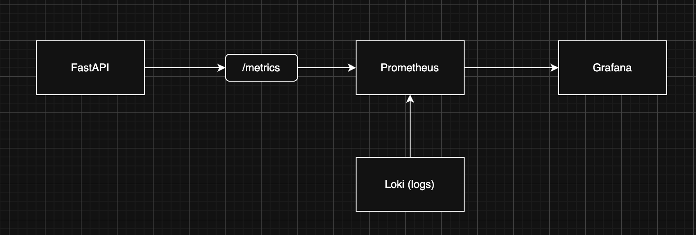
## Application Instrumentation
Following RED method (Rate → request count ; Errors → status codes; Duration → latency ) I have implemented such metrics :

1. Counter
http_requests_total
Tracks number of requests
Labels: method, endpoint, status
2. Histogram
http_request_duration_seconds
Tracks response time distribution
3. Gauge
http_requests_in_progress
Tracks active requests


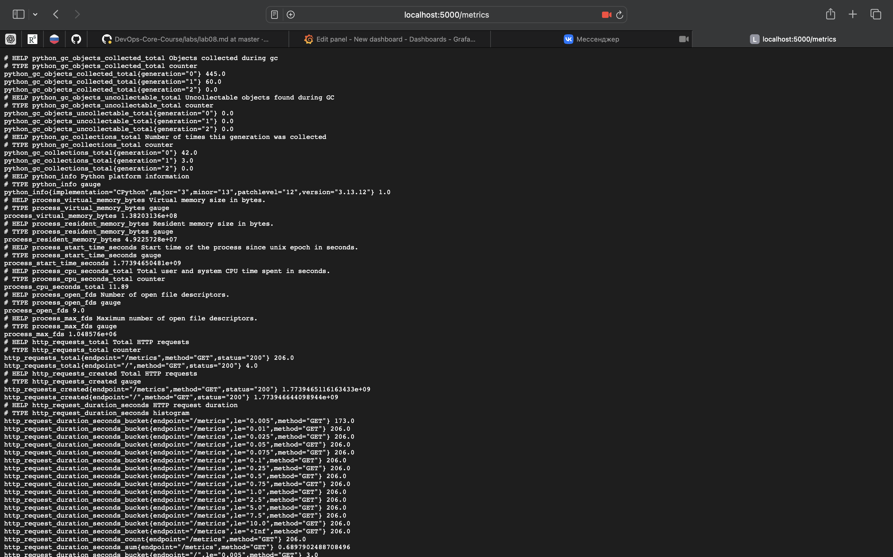


## Prometheus Configuration

### Scrape Targets

Prometheus is configured to scrape multiple targets that represent different components of the observability stack.

The following targets are defined:

* Application (app)
    
    Endpoint: devops-python:5000/metrics
    
    Purpose: collects custom application metrics such as request count, latency, and active requests.

This is the most important target as it provides business-level insights.

* Prometheus (prometheus)
    
    Endpoint: localhost:9090
    
    Purpose: monitors Prometheus itself (health, performance, internal metrics).

* Loki (loki)
    
    Endpoint: loki:3100/metrics
    
    Purpose: collects metrics about the logging system (ingestion rate, errors, performance).

* Grafana (grafana)

    Endpoint: grafana:3000/metrics

    Purpose: monitors dashboard system health and usage.

All targets are defined using Docker service names, which allows Prometheus to resolve them via the internal Docker network.


### Scrape Interval

The global scrape interval is set to:
``` scrape_interval: 15s```
This means Prometheus collects metrics from each target every 15 seconds.

Reasoning:
* Provides near real-time monitoring
* Balanced trade-off between data granularity and system load
* Lower intervals (e.g., 5s) increase load
* Higher intervals (e.g., 60s) reduce accuracy

### Data Retention

Prometheus is configured with the following retention settings:
* Time-based retention: 15 days
* Size-based retention: 10GB
Configured via:
```--storage.tsdb.retention.time=15d```
```--storage.tsdb.retention.size=10GB```

Purpose of retention:
* Limits disk usage
* Improves query performance by reducing dataset size
* Ensures older data is automatically removed


Evidence that all the components are connected
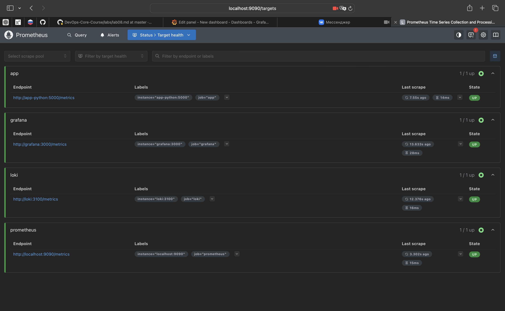

## Dashboard Walkthrough

Request Rate :
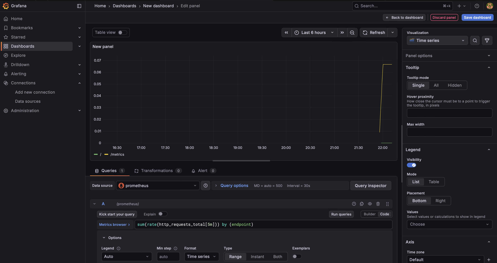

Error Rate :
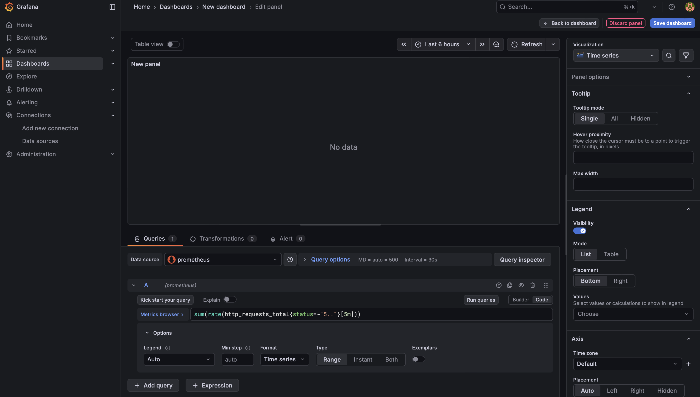

Latency p95 :
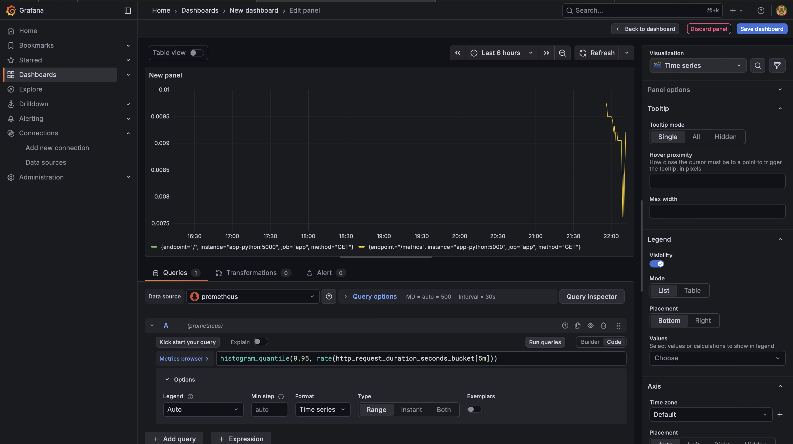

Request Duration Heatmap : 
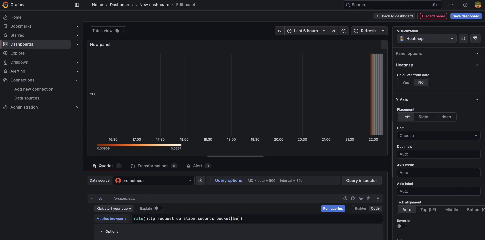

Active Requests :
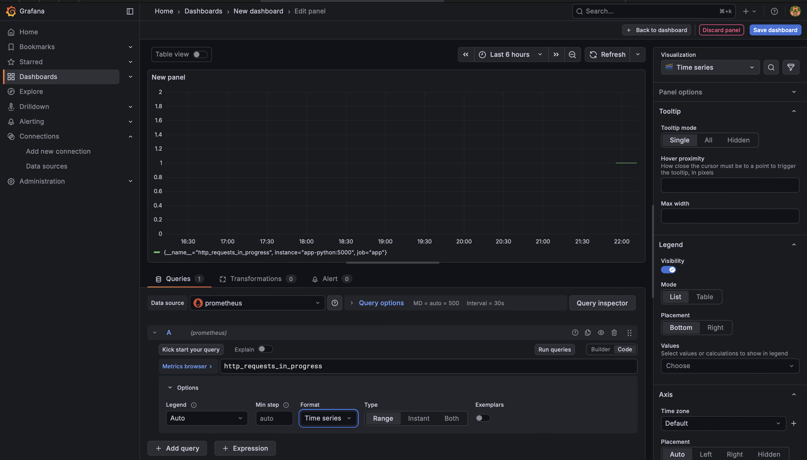

Status Codes :
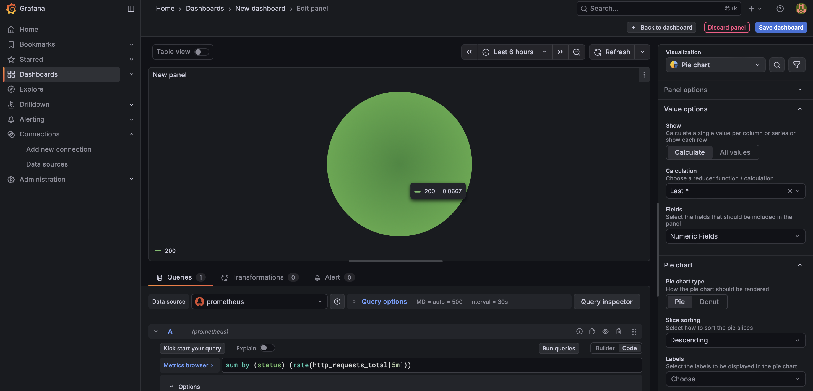

Uptime :
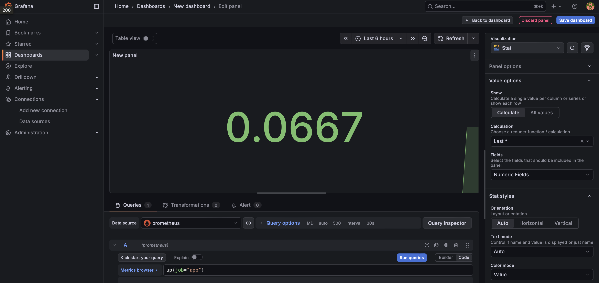
## PromQL Examples

1. Requests per method
    
    ```sum by (method) (rate(http_requests_total[5m]))```
    
    Explanation:
Shows requests per second grouped by HTTP method (GET, POST, etc.). Useful to understand traffic patterns.
2. Top endpoints by traffic
    ```topk(3, sum by (endpoint) (rate(http_requests_total[5m])))```
    Explanation:
Displays top 3 endpoints with the highest request rate. Helps identify the most used API routes.
3. Error percentage

    ```(sum(rate(http_requests_total{status=~"5.."}[5m])) / sum(rate(http_requests_total[5m]))) * 100```

    Explanation:
Calculates percentage of failed requests (5xx errors). Important for reliability monitoring.
4. Average request duration
    
    ```rate(http_request_duration_seconds_sum[5m]) / rate(http_request_duration_seconds_count[5m])```
    
    Explanation:
Calculates average response time over 5 minutes using histogram data.
5. Requests per status code per endpoint

    ```sum by (endpoint, status) (rate(http_requests_total[5m]))```

    Explanation:
Breaks down traffic by endpoint and HTTP status codes (e.g., 200, 404, 500).

## Production Setup

* Health Checks
    * loki: /ready
    * app-python: /health
    * prometheus: /-/healthy
    * grafana: /api/health

* Resource Limits
    * prometheus: 1 CPU / 1GB
    * grafana: 0.5 CPU / 512MB
    * app-python: 0.5 CPU / 256MB

* Retention (Prometheus retention time/size)
    * 15 days
    * 10GB

* Persistence volumes used for:
    * Prometheus
    * Loki
    * Grafana

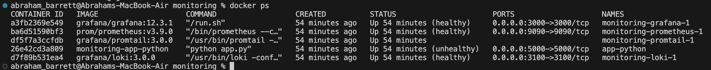
## Testing Results
I have tested the availability of the service such way: 
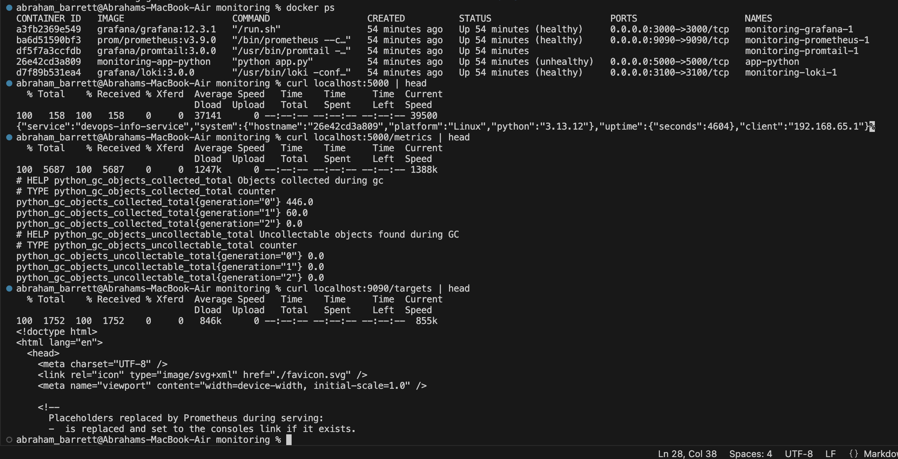
## Challenges & Solutions
In general there were no difficulties
