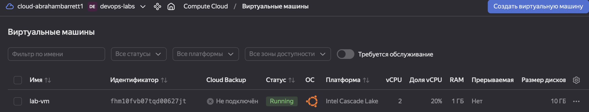
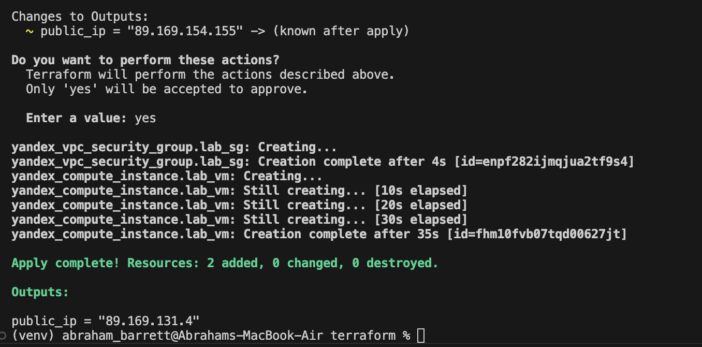
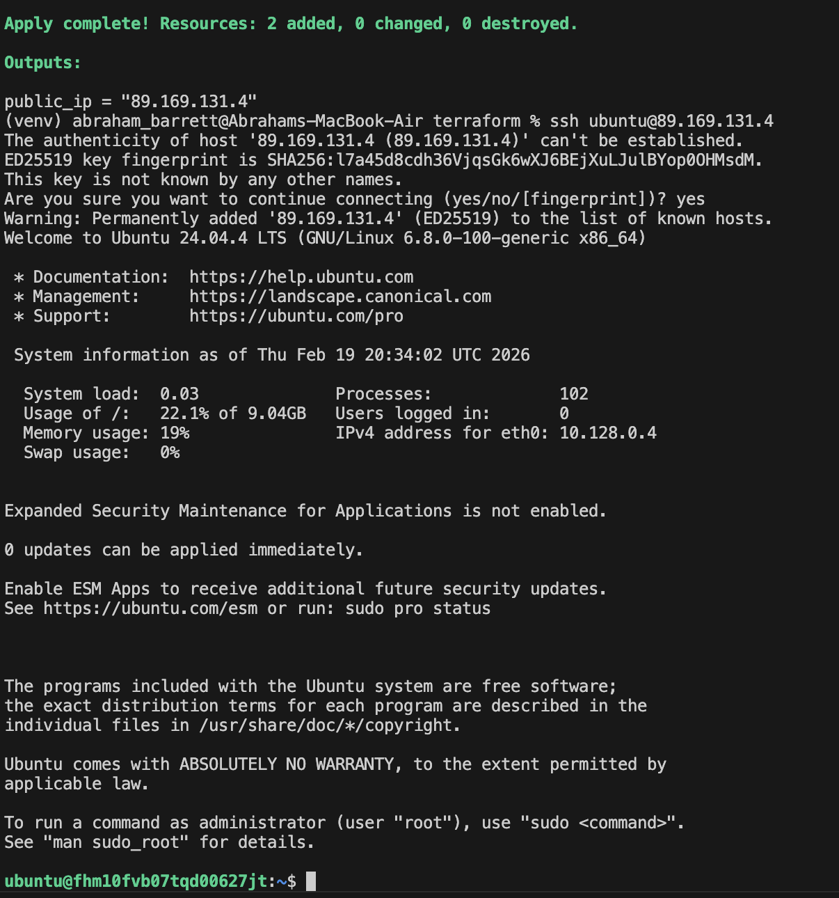

# Lab 04 . Terraform / Pulumi

## 1. Cloud Provider & Infrastructure

- As a provider, I have chosen Yandex Cloud since this service has a free period, it does not force me to use proxy servers to connect. 
- As an instance, I have created a VM with ubuntu (1 cpu and 10 GB of HDD since it is enough for my lightweight application)
- As a region I have chosen "ru-central1-a". It is an alias related to the Russian region, that increases the availability of my service.
- Total cost equals to 0$, since I have used grant for the first usage (free period).
- I have created several instances : 

    - Service account that manages all the credentials
    - Network and subnetwork for traffic management
    - DNS record for some purposes related to amdin usage
    - VM itself

## 2. Terraform Implementation

- Terraform version = v1.9.0
- Project Structure Explanation

    The Terraform project was structured using separate files for clarity and maintainability:
    - ```main.tf``` contains core infrastructure resources (network, security group, VM).
    - ```providers.tf``` contains provider data
    - ```output.tf``` contains all the data that I will obtain in output after VM creation.
    - ```variables.tf``` defines all input variables.
    - ```terraform.tfvars``` stores sensitive and environment-specific values.
This structure follows Terraform best practices and improves readability.
- Key Configuration Decisions
    - The default VPC network and subnet were reused via data sources to avoid unnecessary resource creation.
    - SSH access was restricted using a security group with a specific allowed IP address.
    - The SSH public key was injected into VM metadata using the file() function to avoid hardcoding credentials.
- Challenges Encountered

    - As for me, I have spent a lot of time on creating and configuring ssh connections since it was unclear for me that I can generate rsa keys myself instead of using those, that I obtained when creating service account.
- Terminal output from key commands: (I had a lot of troubles when creating terraform configs, so in my logs, I document not the first try and ```terraform plan``` and ```terraform apply``` only checks that on server I have the latest version)
```
- terraform init
```
```bash
Initializing the backend...

Initializing provider plugins...
- Finding yandex-cloud/yandex versions matching "~> 0.100"...
- Installing yandex-cloud/yandex v0.187.0...
- Installed yandex-cloud/yandex v0.187.0 (self-signed, key ID E40F590B50BB8E40)

Terraform has created a lock file .terraform.lock.hcl to record the provider selections it made above.

Terraform has been successfully initialized!

You may now begin working with Terraform. Try running "terraform plan" to see
any changes that are required for your infrastructure. All Terraform commands
should now work.
```
    - terraform plan (sanitized, no secrets)
```bash
abraham_barrett@Abrahams-MacBook-Air terraform % terraform plan
var.ssh_public_key
  SSH public key

  Enter a value: ssh-ed25519 AAAAC3NzaC1lZDI1NTE5AAAAIJAD33+mhaWrq126MfUmhWC86Dd95xQ9mvGXPC+6Xmex lab04-yc

data.yandex_compute_image.ubuntu: Reading...
data.yandex_vpc_network.default: Reading...
data.yandex_vpc_subnet.default: Reading...
data.yandex_compute_image.ubuntu: Read complete after 0s [id=fd8q1krrgc5pncjckeht]
data.yandex_vpc_subnet.default: Read complete after 1s [id=e9bu69enu1ev2gcl79nl]
data.yandex_vpc_network.default: Read complete after 1s [id=enp93sgg09cutu4hr44s]
yandex_vpc_security_group.lab_sg: Refreshing state... [id=enpqgrneh2kl2doh8u9b]
yandex_compute_instance.lab_vm: Refreshing state... [id=fhmd4hk9b586v11h6dqu]

No changes. Your infrastructure matches the configuration.

Terraform has compared your real infrastructure against your configuration and found no differences, so no changes are needed.

```
    - terraform apply
```bash
abraham_barrett@Abrahams-MacBook-Air terraform % terraform apply          
var.ssh_public_key
  SSH public key

  Enter a value: ssh-ed25519 AAAAC3NzaC1lZDI1NTE5AAAAIJAD33+mhaWrq126MfUmhWC86Dd95xQ9mvGXPC+6Xmex lab04-yc

data.yandex_vpc_network.default: Reading...
data.yandex_compute_image.ubuntu: Reading...
data.yandex_vpc_subnet.default: Reading...
data.yandex_compute_image.ubuntu: Read complete after 1s [id=fd8q1krrgc5pncjckeht]
data.yandex_vpc_subnet.default: Read complete after 1s [id=e9bu69enu1ev2gcl79nl]
data.yandex_vpc_network.default: Read complete after 1s [id=enp93sgg09cutu4hr44s]
yandex_vpc_security_group.lab_sg: Refreshing state... [id=enpqgrneh2kl2doh8u9b]
yandex_compute_instance.lab_vm: Refreshing state... [id=fhmd4hk9b586v11h6dqu]

No changes. Your infrastructure matches the configuration.

Terraform has compared your real infrastructure against your configuration and found no differences, so no changes are needed.

Apply complete! Resources: 0 added, 0 changed, 0 destroyed.

Outputs:

public_ip = "89.169.154.155"
abraham_barrett@Abrahams-MacBook-Air terraform %    
```
    - ssh connection
```bash
abraham_barrett@Abrahams-MacBook-Air terraform % ssh ubuntu@89.169.154.155
The authenticity of host '89.169.154.155 (89.169.154.155)' can't be established.
ED25519 key fingerprint is SHA256:IzmvYr+LtTIZ/v1vQHW+xMbba8AS9lq/VZRTkTtPvdo.
This key is not known by any other names.
Are you sure you want to continue connecting (yes/no/[fingerprint])? yes
Warning: Permanently added '89.169.154.155' (ED25519) to the list of known hosts.
Welcome to Ubuntu 24.04.4 LTS (GNU/Linux 6.8.0-100-generic x86_64)

 * Documentation:  https://help.ubuntu.com
 * Management:     https://landscape.canonical.com
 * Support:        https://ubuntu.com/pro

 System information as of Thu Feb 19 17:54:26 UTC 2026

  System load:  0.23              Processes:             101
  Usage of /:   22.1% of 9.04GB   Users logged in:       0
  Memory usage: 19%               IPv4 address for eth0: 10.128.0.30
  Swap usage:   0%


Expanded Security Maintenance for Applications is not enabled.

0 updates can be applied immediately.

Enable ESM Apps to receive additional future security updates.
See https://ubuntu.com/esm or run: sudo pro status


The programs included with the Ubuntu system are free software;
the exact distribution terms for each program are described in the
individual files in /usr/share/doc/*/copyright.

Ubuntu comes with ABSOLUTELY NO WARRANTY, to the extent permitted by
applicable law.

To run a command as administrator (user "root"), use "sudo <command>".
See "man sudo_root" for details.

ubuntu@fhmd4hk9b586v11h6dqu:~$ ls -la
total 28
drwxr-x--- 4 ubuntu ubuntu 4096 Feb 19 17:54 .
drwxr-xr-x 3 root   root   4096 Feb 19 17:53 ..
-rw-r--r-- 1 ubuntu ubuntu  220 Mar 31  2024 .bash_logout
-rw-r--r-- 1 ubuntu ubuntu 3771 Mar 31  2024 .bashrc
drwx------ 2 ubuntu ubuntu 4096 Feb 19 17:54 .cache
-rw-r--r-- 1 ubuntu ubuntu  807 Mar 31  2024 .profile
drwx------ 2 ubuntu ubuntu 4096 Feb 19 17:53 .ssh
ubuntu@fhmd4hk9b586v11h6dqu:~$ exit
logout
Connection to 89.169.154.155 closed.
```

## 3. Pulumi Implementation

- Pulumi version = v3.222.0 and language = Python
- How Code Differs from Terraform
    - Unlike Terraform’s declarative HCL, Pulumi uses imperative programming constructs. Infrastructure is defined using Python code, allowing the use of variables, functions, and conditionals. This makes the code more flexible but also more complex.
- Advantages Discovered
    - Pulumi allows reuse of programming language features such as loops and abstractions, which reduces code duplication. Debugging is easier because standard language tools and error messages can be used. Infrastructure logic feels more natural in complex scenarios.
- Challenges Encountered
    - In fact I did not have such difficulties as I had in terraform, so it was pretty simple for me to cope with this task.
- Terminal output from:
- pulumi preview
```bash
(venv) abraham_barrett@Abrahams-MacBook-Air pulumi % pulumi preview                                        
Previewing update (dev)

View in Browser (Ctrl+O): https://app.pulumi.com/Abraham14711-org/lab04-yandex/dev/previews/5ce2812b-d968-4556-9de8-85240fc90075

     Type                              Name              Plan       
 +   pulumi:pulumi:Stack               lab04-yandex-dev  create     
 +   ├─ yandex:index:VpcSecurityGroup  dev-sg            create     
 +   └─ yandex:index:ComputeInstance   dev-instance      create     

Outputs:
    connect_ssh: [unknown]
    instance_id: [unknown]
    private_ip : [unknown]
    public_ip  : [unknown]

Resources:
    + 3 to create

```
- pulumi up
```bash
(venv) abraham_barrett@Abrahams-MacBook-Air pulumi % pulumi up                                             
Previewing update (dev)

View in Browser (Ctrl+O): https://app.pulumi.com/Abraham14711-org/lab04-yandex/dev/previews/30427911-9793-4fbd-a7b4-1bad983bb3ca

     Type                              Name              Plan       
 +   pulumi:pulumi:Stack               lab04-yandex-dev  create     
 +   ├─ yandex:index:VpcSecurityGroup  dev-sg            create     
 +   └─ yandex:index:ComputeInstance   dev-instance      create     

Outputs:
    connect_ssh: [unknown]
    instance_id: [unknown]
    private_ip : [unknown]
    public_ip  : [unknown]

Resources:
    + 3 to create

Do you want to perform this update? yes
Updating (dev)

View in Browser (Ctrl+O): https://app.pulumi.com/Abraham14711-org/lab04-yandex/dev/updates/1

     Type                              Name              Status            
 +   pulumi:pulumi:Stack               lab04-yandex-dev  created (49s)     
 +   ├─ yandex:index:VpcSecurityGroup  dev-sg            created (3s)      
 +   └─ yandex:index:ComputeInstance   dev-instance      created (41s)     

Outputs:
    connect_ssh: "ssh ubuntu@93.77.190.237"
    instance_id: "fhmr6hjcij7196o3pfa7"
    private_ip : "10.128.0.7"
    public_ip  : "93.77.190.237"

Resources:
    + 3 created

Duration: 50s
```
- ssh connection
```bash
(venv) abraham_barrett@Abrahams-MacBook-Air pulumi % ssh ubuntu@93.77.190.237
ssh: connect to host 93.77.190.237 port 22: Connection refused
(venv) abraham_barrett@Abrahams-MacBook-Air pulumi % ssh ubuntu@93.77.190.237
ssh: connect to host 93.77.190.237 port 22: Connection refused
(venv) abraham_barrett@Abrahams-MacBook-Air pulumi % ssh ubuntu@93.77.190.237
The authenticity of host '93.77.190.237 (93.77.190.237)' can't be established.
ED25519 key fingerprint is SHA256:xW/f6/1kHU+W3D7G7uc1QY7cDPHwDCgCiYaf2DzMW+M.
This key is not known by any other names.
Are you sure you want to continue connecting (yes/no/[fingerprint])? yes
Warning: Permanently added '93.77.190.237' (ED25519) to the list of known hosts.
Welcome to Ubuntu 24.04.4 LTS (GNU/Linux 6.8.0-100-generic x86_64)

 * Documentation:  https://help.ubuntu.com
 * Management:     https://landscape.canonical.com
 * Support:        https://ubuntu.com/pro

 System information as of Thu Feb 19 18:20:55 UTC 2026

  System load:  0.55              Processes:             104
  Usage of /:   22.1% of 9.04GB   Users logged in:       0
  Memory usage: 20%               IPv4 address for eth0: 10.128.0.7
  Swap usage:   0%


Expanded Security Maintenance for Applications is not enabled.

0 updates can be applied immediately.

Enable ESM Apps to receive additional future security updates.
See https://ubuntu.com/esm or run: sudo pro status


The programs included with the Ubuntu system are free software;
the exact distribution terms for each program are described in the
individual files in /usr/share/doc/*/copyright.

Ubuntu comes with ABSOLUTELY NO WARRANTY, to the extent permitted by
applicable law.

To run a command as administrator (user "root"), use "sudo <command>".
See "man sudo_root" for details.

ubuntu@fhmr6hjcij7196o3pfa7:~$ exit
logout
Connection to 93.77.190.237 closed.
(venv) abraham_barrett@Abrahams-MacBook-Air pulumi % 
```

## 4. Terraform vs Pulumi Comparison
### Ease of Learning
Terraform was easier to learn initially because of its declarative HCL syntax and a large number of simple tutorials. The basic concepts such as providers, resources, and variables are straightforward and well structured. Pulumi has a steeper learning curve since it requires knowledge of a programming language (e.g., Python), which adds additional complexity for beginners.
### Code Readability
Pulumi felt more readable and flexible because infrastructure is described using a general-purpose programming language. Loops, conditions, and abstractions are expressed naturally in code. Terraform configuration can become repetitive and verbose when infrastructure grows more complex.
### Debugging
Debugging was easier in Pulumi because standard programming tools (prints, debuggers, stack traces) can be used. In Terraform, debugging mostly relies on reading plan output and error messages, which can be less intuitive when errors are indirect or related to state.
### Documentation
Terraform has more mature documentation and a larger ecosystem of examples due to its long presence on the market. Most common use cases are well documented and easy to find. Pulumi documentation is clear but has fewer real-world examples, especially for specific cloud providers.
### Use Case
Terraform is well suited for standard, declarative infrastructure and teams that want a simple and widely adopted IaC tool. Pulumi is preferable when infrastructure logic is complex, requires conditions or reuse, or when a team wants to use familiar programming languages to manage infrastructure.

## 5. Lab 5 Preparation & Cleanup

VM for Lab 5:

Are you keeping your VM for Lab 5? (Yes/No) - Yes
If yes: Which VM (Terraform or Pulumi created)? -Terraform
If no: What will you use for Lab 5? (Local VM/Will recreate cloud VM)
Cleanup Status:

If keeping VM for Lab 5: Show VM is still running and accessible - Yes, The following screenshots show that the VM is accessible. (Yes, I have created a new one with another IP.)






